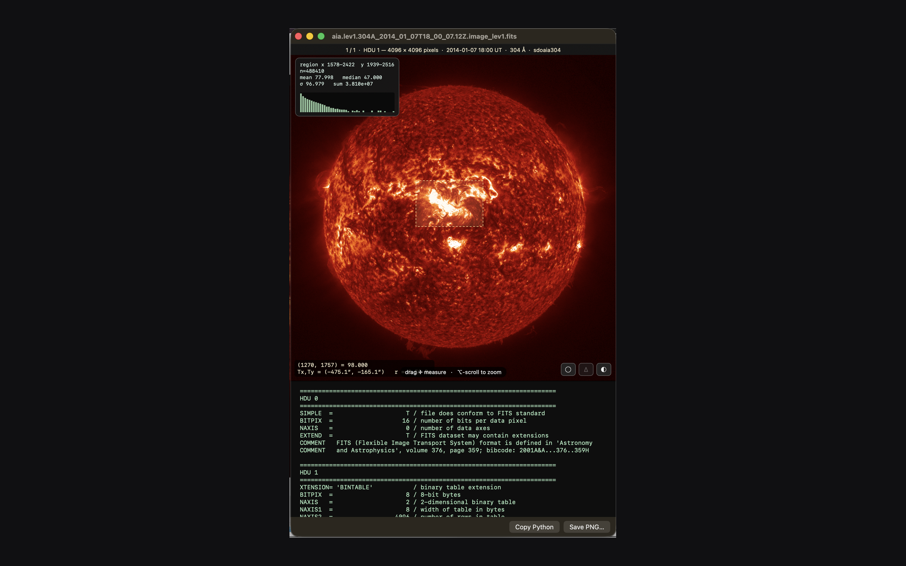

# HelioFITS

**HelioFITS teaches Finder to read solar FITS files.** Press Space on any
`.fits` file and it renders instantly — in the correct instrument colormap,
drawn from the [sunpy](https://sunpy.org) standard. SDO/AIA, HMI magnetograms,
LASCO, SUVI, EIT, STEREO, PUNCH, K-Cor, TRACE, XRT and more are recognized from
the header; nothing to configure.

Built by a solar physicist, for the archive already sitting on your disk.

## What it does

- **Quick Look previews** — press Space in Finder; scroll to blink between HDUs,
  pixel-registered. Colored **thumbnails** for every FITS file, and **Get Info /
  Spotlight** metadata: telescope, instrument, wavelength, observation date,
  exposure, dimensions, HDU count.
- **Coordinates you can trust** — hover any pixel for its value plus its
  helioprojective (Tx, Ty) and distance from disk center in R☉. The WCS solution
  does real spherical deprojection (TAN, ARC, SIN, CAR), honors CUNIT, PC/CD
  matrices and CROTA2, and is pinned against astropy in the test suite. It
  refuses to guess: an unsupported projection produces no readout rather than a
  plausible wrong number.
- **Measure without leaving Finder** — drag a box for mean/median/σ/sum/min/max
  at full native resolution, with a histogram. Toggle the solar limb. Adjust the
  stretch live (percentile clip, gamma, log).
- **Back to Python in one click** — copy a sunpy snippet that loads exactly the
  HDU you're looking at, export any HDU to PNG, or convert a whole folder.

## Install

> **Requires an Apple Silicon Mac** (M1 or later) running macOS 14.5+.
> Intel Macs are not yet supported — see
> [#1](https://github.com/GillySpace27/HelioFITS/issues/1).

**Mac App Store** — *in review; link coming soon.*

**Direct download** — grab `HelioFITS.zip` from the
[latest release](https://github.com/GillySpace27/HelioFITS/releases/latest),
unzip, and drag `HelioFITS.app` into `/Applications`. The app is notarized by
Apple, so it opens with no security warnings. Launch it once to register the
Finder extensions (if a thumbnail looks generic at first, relaunch Finder).

> The direct-download build does **not** self-update. Watch the
> [Releases page](https://github.com/GillySpace27/HelioFITS/releases)
> (or subscribe to its [feed](https://github.com/GillySpace27/HelioFITS/releases.atom))
> for new versions. The App Store build updates automatically.

## Sample data

The repo ships no FITS files. Free solar data to try it on:

- SDO (AIA/HMI): <https://sdo.gsfc.nasa.gov/data/> or via
  [sunpy Fido](https://docs.sunpy.org/en/stable/tutorial/acquiring_data/)
- PUNCH: <https://umbra.nascom.nasa.gov/punch/>
- Virtual Solar Observatory: <https://sdac.virtualsolar.org>

## Reporting bugs

Open an issue: <https://github.com/GillySpace27/HelioFITS/issues>. Attaching (or
linking) a FITS file that reproduces the problem makes fixes much faster.

## Building from source

Open `HelioFITS.xcodeproj` in Xcode and build the `HelioFITS` scheme (Apple
Silicon Mac required — the vendored CFITSIO static library is arm64-only). Run
the tests with the scheme's Test action. `ship.sh` documents the notarized
release flow; `RELEASING.md` the full two-channel release process.

## Privacy

HelioFITS collects nothing and has no network entitlement — the macOS sandbox
denies it all internet access. See [PRIVACY.md](PRIVACY.md).

## License

[BSD 2-Clause](LICENSE). Vendors [CFITSIO](https://heasarc.gsfc.nasa.gov/fitsio/)
by William Pence (NASA HEASARC) — see
[its license](HelioFITSExtension/cfitsio/LICENSE). Instrument colormaps are
generated from [sunpy](https://sunpy.org).
