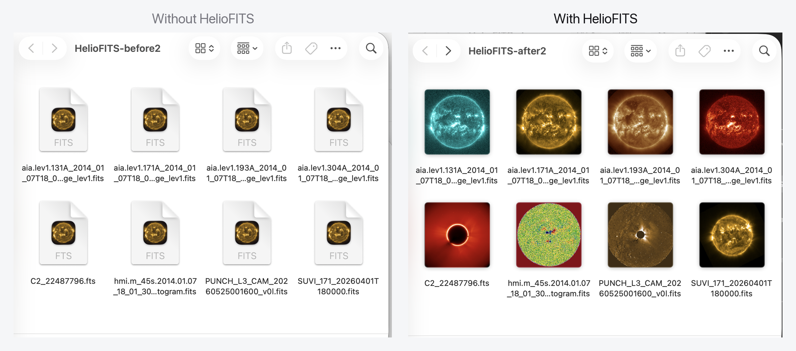
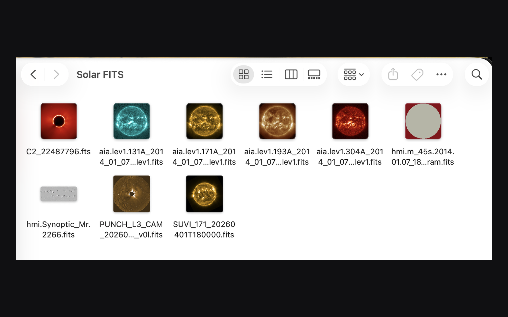
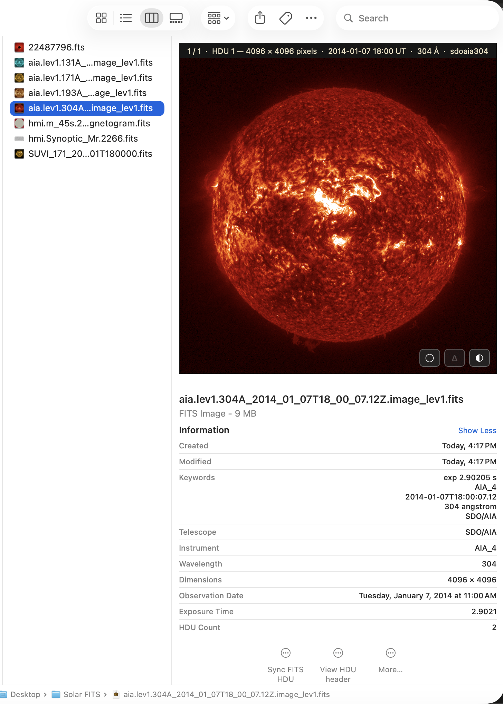
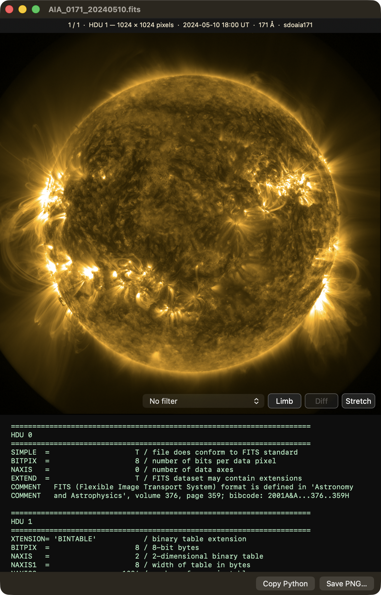

<div align="center">

# HelioFITS

### Know what you're looking at — before you open a thing.



**Solar FITS files, previewable in Finder — in the right colors, with real coordinates.**

[](LICENSE)
&nbsp;·&nbsp; macOS 14.5+ (universal — Apple Silicon & Intel)
&nbsp;·&nbsp; Free & open source
&nbsp;·&nbsp; No network access

</div>

---

Do you have a hundred directories of FITS files and no way to preview them
without launching a heavy application for each one? On the left above, every file
is the same grey icon — you can't tell an EUV frame from a magnetogram without
opening each one. On the right is the same folder with HelioFITS installed. That's
the whole idea.

**HelioFITS teaches Finder to read solar FITS files.** Once it's installed, your
`.fits` files stop being rows of identical grey document icons and become what
they actually are — the Sun, rendered in the correct instrument colormap. Press
the spacebar on any of them and you get an interactive preview with pixel values,
helioprojective coordinates, region statistics, and multi-HDU blink comparison,
without opening anything.

It's built by a solar physicist, for the archive already sitting on your disk. It
recognizes SDO/AIA, HMI magnetograms, LASCO, SUVI, EIT, STEREO, PUNCH, K‑Cor,
TRACE, and XRT straight from the header — nothing to configure. There is no
account, no telemetry, and no network access of any kind.

## Three ways it makes Finder understand FITS

HelioFITS is three small system extensions plus a viewer. Each lights up a
different part of macOS, and they all work together — no app window required.

### 1 · Thumbnails, on every icon



The thumbnail extension renders each FITS file's default image in the colormap its
header calls for — AIA gold, a diverging red/blue magnetogram, a LASCO coronagraph,
a PUNCH heliospheric mosaic. Icon view, gallery view, the icons in list and column
views: all of them show the real image. A directory of solar data becomes browsable
the way a folder of photos is.

### 2 · Interactive previews, from the spacebar

<table>
<tr>
<td width="50%"></td>
<td width="50%"></td>
</tr>
</table>

Select a `.fits` file and press the **spacebar** — the standard macOS Quick Look —
and HelioFITS draws the image live. This is not a static picture; the preview is
interactive everywhere it appears (the spacebar panel, gallery view, and the column
pane):

- **Hover** any pixel to read its value together with its helioprojective
  coordinate (Tx, Ty) and distance from disk center in solar radii.
- **Drag a box** for region statistics — mean, median, σ, sum, min, max — computed
  at full native resolution, with a live histogram.
- **Scroll** to blink between HDUs (a FITS file's stacked image extensions),
  pixel‑registered, to compare processing levels or filters.
- **Toggle** the solar limb, a running difference between HDUs, a live stretch
  (percentile clip, gamma, log), or the **RHEF** filter — a radial histogram
  equalization ([Gilly & Cranmer 2025](https://doi.org/10.1007/s11207-025-02578-x))
  that flattens the steep coronal falloff to reveal faint off‑limb structure at
  every height. None of it touches the file.
- **⌥‑scroll** to zoom about the cursor.

The world‑coordinate math does the real spherical deprojection (TAN, ARC, SIN,
CAR), honors CUNIT, the PC and CD matrices, and CROTA2, and is pinned against
astropy in the test suite. When it meets a projection it can't handle, it shows no
coordinate rather than a plausible wrong one.

### 3 · Metadata, in Get Info and Spotlight



The Spotlight importer pulls the header fields you actually search on — telescope,
instrument, wavelength, observation date, exposure, dimensions, HDU count — into
Finder's **Get Info** panel and makes them Spotlight‑searchable. You can find every
171 Å frame on your disk with a query.

### And a viewer, when you want more



Double‑click a FITS file to open the built‑in viewer: the interactive image on top,
the complete FITS header beneath. From here you can **export any HDU to PNG** for a
slide or a paper, or **copy a ready‑to‑run sunpy snippet** that loads exactly the
HDU you're looking at — a one‑click bridge back to Python.

---

## Install

> **Runs on any Mac** — Apple Silicon or Intel — with macOS 14.5 or later. It's a
> universal binary.

**Direct download (available now).** Grab `HelioFITS.zip` from
**[gilly.space/heliofits](https://gilly.space/heliofits)** (the always-latest
release), unzip, and drag `HelioFITS.app` into `/Applications`. It's notarized by
Apple, so it opens with no security warnings. Launch it once so macOS registers the
Finder extensions, then press the spacebar on any `.fits` file. (If a thumbnail still
looks generic, relaunch Finder or log out and back in.)

**Mac App Store.** A build is in review; the link will appear here once it's live.

> The direct-download build does **not** self-update. Watch the
> [Releases page](https://github.com/GillySpace27/HelioFITS/releases) (or its
> [feed](https://github.com/GillySpace27/HelioFITS/releases.atom)) for new versions.
> The App Store build updates automatically.

### Getting FITS files to try

The repo ships no data. Any solar `.fits` file works — free sources include
[SDO data](https://sdo.gsfc.nasa.gov/data/), the
[Virtual Solar Observatory](https://sdac.virtualsolar.org/),
[PUNCH](https://umbra.nascom.nasa.gov/punch/), and
[sunpy's Fido](https://docs.sunpy.org/en/stable/tutorial/acquiring_data/).
`.fz` (fpack) and Rice‑compressed files work natively.

## Settings

Open **HelioFITS ▸ Settings…** (⌘,). A FITS file can stack several images as
separate **Header Data Units (HDUs)** — also called *extensions*, each labelled by
its `EXTNAME` (say, a raw frame, a processed layer, and an uncertainty map).
HelioFITS shows the first image HDU by default; the settings panel lets you change
that globally, or **pin a folder** to a specific HDU so an entire directory previews
the same layer for apples‑to‑apples comparison.

## Supported instruments

AIA · HMI (line‑of‑sight magnetograms and synoptic B_r charts) · LASCO C2/C3 ·
SUVI · EIT · STEREO/SECCHI (EUVI, COR, HI) · PUNCH (including its polarized Stokes
cubes) · K‑Cor · TRACE · XRT. Instrument is recognized from
`TELESCOP`/`INSTRUME`/`DETECTOR`; anything unrecognized falls back to a sensible
grayscale stretch. Missing one?
[Open an issue](https://github.com/GillySpace27/HelioFITS/issues) — colormaps are
easy to add.

## Reporting bugs

Open an issue: <https://github.com/GillySpace27/HelioFITS/issues>. Attaching (or
linking) a FITS file that reproduces the problem makes fixes much faster. If a
readout ever disagrees with what sunpy tells you, I especially want to know.

## Building from source

```sh
git clone https://github.com/GillySpace27/HelioFITS.git
cd HelioFITS
xcodebuild -project HelioFITS.xcodeproj -scheme HelioFITS -configuration Release \
  -destination 'platform=macOS,arch=arm64' build
```

Apple Silicon Mac required — the vendored CFITSIO static library is arm64‑only.
Tests live under `HelioFITSTests/` (the WCS math is pinned against astropy ground
truth); run them with the scheme's Test action. `ship.sh` documents the notarized
release flow and `RELEASING.md` the full two‑channel process.

## Privacy

HelioFITS collects nothing and has **no network entitlement** — the macOS sandbox
denies it all internet access, so nothing can leave your Mac. No accounts, no
analytics, no telemetry. See [PRIVACY.md](PRIVACY.md).

## License & credits

[BSD 2‑Clause](LICENSE). Vendors [CFITSIO](https://heasarc.gsfc.nasa.gov/fitsio/)
by William Pence (NASA HEASARC) — see
[its license](HelioFITSExtension/cfitsio/LICENSE). Instrument colormaps are the
standard [sunpy](https://sunpy.org) color tables.

Built by **Dr. Chris "Gilly" Gilbert**, heliophysics research scientist at
[NorthWest Research Associates](https://www.nwra.com) · [gilly.space](https://www.gilly.space).
